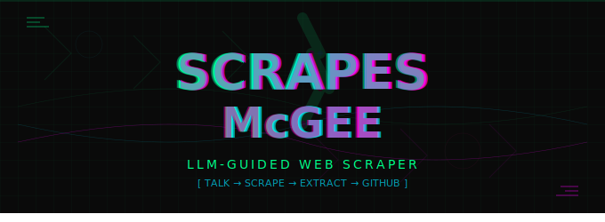

<div align="center">
  
  
# Scrapes McGee 🕷️
```

---

### **2. Add Repository Description** (on GitHub)

Click "About" (gear icon on right side), add:
- **Description:** `LLM-guided web scraper with personality — talk to McGee, get targeted content extraction`
- **Website:** Leave blank or add your portfolio
- **Topics:** `web-scraping`, `llm`, `gemini`, `python`, `ai-agent`, `automation`

---

### **3. Optional: Add a License**

On GitHub: Add file → Create new file → Name it `LICENSE`

Paste MIT license (if you want open source):
```
MIT License

Copyright (c) 2025 Merry

Permission is hereby granted, free of charge...
# Scrapes McGee 🕷️

**LLM-guided web scraper with personality — talk to McGee, get targeted content extraction**

Scrapes McGee is a conversational web scraper that uses AI to understand what you want and extract it intelligently. No CSS selectors, no regex hell — just tell McGee what you're looking for in natural language.

---

## Why McGee Kicks Ass

**Most scrapers online:**
- Hardcoded CSS selectors that break when sites change
- Dumb link following (scrape everything or nothing)
- No content filtering — you wade through garbage
- Configuration is painful YAML/JSON hell

**Scrapes McGee:**
- ✅ **LLM-guided extraction** — describe what you want, McGee figures it out
- ✅ **Smart link following** — only crawls pages that match your criteria
- ✅ **Conversational interface** — chat with McGee like a colleague
- ✅ **Adaptive** — handles site structure changes automatically
- ✅ **Context-aware** — remembers what it found, avoids duplicates
- ✅ **Go 2-3+ links deep** — intelligent depth control with quality filtering

---

## Quick Start

### 1. Clone and Setup

```bash
git clone https://github.com/merrypranxter/scrapes-mcgee.git
cd scrapes-mcgee

# Install dependencies
pip install -e .

# Or use uv (faster)
uv pip install -e .
```

### 2. Get a Gemini API Key

1. Go to [Google AI Studio](https://aistudio.google.com/app/apikey)
2. Create an API key
3. Create `.env` file:

```bash
echo "GEMINI_API_KEY=your_key_here" > .env
```

### 3. Run McGee

```bash
python scrapes.py
```

### 4. Start Scraping

```
You: scrape erowid for DMT entity encounters, grab about 50 reports

McGee: Aight, hunting for machine elves on Erowid. Targeting experience 
       vaults, looking for breakthrough + entity keywords. Want me to grab 
       dosages and entity descriptions too?

You: yeah, and only the weird ones, skip boring shit

McGee: Got it — filtering for high-weirdness reports. Starting crawl...
       [shows progress]
       Found 12 so far. This one mentions 'autonomous hypercube beings' 👀
       Keep going?

You: keep going, get to 50

McGee: [continues...]
       Done. 53 reports extracted. Top entities: jesters (23), 
       geometric beings (18), insectoid intelligence (8).
       Want JSON, markdown, or SQLite?

You: markdown

McGee: ✓ Exported to data/erowid_dmt_20240315.md
```

---

## Features

### 🤖 Natural Language Interface

Just talk to McGee:
```
"scrape shadertoy for voronoi noise techniques"
"get me 100 salvia trip reports, focus on the zipper/wheel entities"
"find all McKenna talks mentioning timewave zero"
"grab shader code from these URLs [paste list]"
```

### 🎯 Smart Content Selection

McGee uses LLMs to:
- Decide which links to follow based on your criteria
- Extract only what you asked for
- Skip irrelevant pages
- Adapt to different site structures

Example config:
```yaml
selection_prompt: |
  Only follow links to experience reports that mention:
  - Geometric entities or beings
  - Breakthrough experiences
  - Entity communication
  
extraction_prompt: |
  Extract:
  - Dosage (mg)
  - Entity description (exact quotes)
  - Duration of contact
```

### 📊 Multiple Output Formats

- **JSON** — structured data for code
- **Markdown** — human-readable with citations
- **YAML** — config-friendly format
- **SQLite** — queryable database with full-text search

### 🧠 Context Memory

McGee remembers:
- What you've already scraped
- Patterns it's finding
- Your preferences

Avoids:
- Re-scraping the same content
- Duplicate reports with different URLs
- Low-quality matches

### 🔍 Intelligent Depth Control

Not just "go 3 links deep" — McGee understands:
```python
stop_conditions = {
    "target_count": 50,           # stop after 50 matching pages
    "content_threshold": "high",  # only high-quality matches
    "max_depth": 5,               # safety limit
    "time_limit": "30min"         # don't run forever
}
```

---

## Example Use Cases

### Erowid Trip Report Corpus
```bash
python scrapes.py

You: scrape erowid DMT experience vault for entity encounters,
     get 50 reports, extract dosage, ROA, and entity descriptions

# McGee handles the rest
```

### McKenna Transcript Collection
```bash
You: get all McKenna talks from organism.earth about language and 
     etymology, extract quotes and concepts

# Results: data/mckenna_language.md
```

### Shader Technique Library
```bash
You: scrape shadertoy for fractal techniques, need code + descriptions

# Results: data/shadertoy_fractals.json
```

---

## Project Structure

```
scrapes-mcgee/
├── scrapes.py              # Main chat interface — run this
├── scraper/                # Core scraping engine
│   ├── core.py            # LLM-guided scraper
│   ├── storage.py         # SQLite + export utilities
│   └── extractors.py      # Content cleaning (future)
├── mcgee/                  # McGee's brain
│   ├── agent.py           # Conversational agent
│   └── personality.py     # McGee's voice (future)
├── targets/                # Example scrape configs
│   └── examples/
│       ├── erowid_dmt_entities.yaml
│       └── mckenna_language.yaml
└── data/                   # Scraped content
    └── scraper.db         # SQLite database
```

---

## Advanced: YAML Configs

For repeated scrapes, save configs:

```yaml
# targets/my_scrape.yaml
target_url: "https://example.com"
max_depth: 3
max_pages: 50

selection_prompt: |
  Only follow links about [topic]

extraction_prompt: |
  Extract:
  - Field 1
  - Field 2
  
output_format: json
```

Load it:
```bash
You: load targets/my_scrape.yaml and run it
```

---

## GitHub Codespaces

1. Fork this repo
2. Click "Code" → "Codespaces" → "Create codespace"
3. Add your `GEMINI_API_KEY` to Codespaces secrets
4. Run `python scrapes.py`

---

## Roadmap

- [x] Core LLM-guided scraper
- [x] Conversational interface
- [x] SQLite storage + FTS
- [x] Multiple export formats
- [ ] Playwright for JS-heavy sites
- [ ] Parallel/async crawling (speed boost)
- [ ] Web UI (chat in browser)
- [ ] Docker deployment
- [ ] MCP server integration
- [ ] Hugging Face Space demo

---

## Tech Stack

| Component | Why |
|-----------|-----|
| **Gemini 2.0 Flash** | Free, huge context (1M tokens), fast |
| **httpx** | Async HTTP requests |
| **BeautifulSoup** | HTML parsing |
| **SQLite + FTS5** | Storage with full-text search |
| **Rich** | Beautiful terminal UI |
| **YAML** | Human-readable configs |

---

## Contributing

McGee is open source! PRs welcome.

**Ideas:**
- New extraction strategies
- Site-specific scrapers
- UI improvements
- Personality enhancements

---

## License

MIT — scrape responsibly, respect robots.txt, don't be a dick.

---

## Questions?

Open an issue or start a discussion. McGee doesn't bite (much).

**Built by:** [@merrypranxter](https://github.com/merrypranxter)  
**Powered by:** Gemini 2.0, chaos, and coffee
